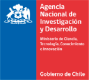
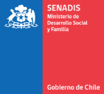
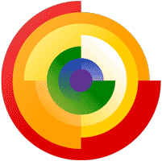

# Pictogramas

**Pictogramas** es una librería gráfica modular para la composición de pictogramas. El foco central de esta librería es promover y facilitar la accesibilidad cognitiva en las transacciones de los servicios públicos. Esta librería es el componente central de **[PICTOS](http://www.pictos.cl)** una aplicación gratuita para hacer los servicios más accesibles. 

Este es un proyecto de bien público y de código abierto. Por favor ayúdanos a mantenerlo con tu donación.
<a href="https://liberapay.com/accesibilidad-inclusion/donate"></a>

### Sistema gráfico

Este sistema permite crear **Pictogramas** a partir de la articulación de 3 elementos o *capas* gráficas. Este pictograma ilustra el paso, de una serie de pasos que constituyen una tarea. PICTOS ayuda a volver más accesibles las tareas de los servicios públicos, sus transacciones. 

Las capas de cada paso o pictograma:

1. **Capa superior:** Acciones del protagonista: *verbo*
2. **Capa media:** Artefactos y elementos: *objeto sustantivo* con el cual se interactúa
3. **Capa contextual:** Espacio y referentes: razgo icónico en su sentido tipológico-situacional


El sistema gráfico permite crear apoyos visuales y procedimentales compuestos por:

1. **Un pictograma** compuesto, as su vez, por 3 capas: acción del protagonista, artefactos o elementos de interacción y espacio y contexto. 
2. **Una instrucción** compuesta por un ícono que refuerza la acción y una frase en lectura fácil o lenguaje llano

Para la construcción correcta de un apoyo visual consistente debe existir una estrecha relación sintáctica entre la instrucción y el pictograma, cosa de establecer una clara correspondencia entre los elementos de la instrucción y los elementos gráficos que la acompañan.

Este sistema permite crear **Pictogramas** a partir de la articulación de 3 elementos o *capas* gráficas. Este pictograma ilustra el paso, de una serie de pasos que constituyen una tarea. PICTOS ayuda a volver más accesibles las tareas de los servicios públicos, sus transacciones. 

Este sistema contiene una colección de posibilidades para cada una de las capas, lo que permite una combinatoria muy amplia de pictogramas que buscamos aumentar gracias al apoyo de la comunidad.

### Estructura

``` JSON
{
    "title": "Pictogramas",
    "description": "Librería gráfica modular para la composición de pictogramas enfocados en la accesibilidad cognitiva",
    "properties": {
        "pictos": [
            {
                "layer": 1,
                "path": "1-subject/ease.svg",
                "label": "Parado",
                "category": ["Trámites","Salud","Transporte","Ocio"],
                "tags": [ "mirar", "esperar", "escuchar","quieto","de pie"]
            },
            {
                "layer": 1,
                "path": "1-subject/push.svg",
                "label": "Presiona",
                "category": ["Trámites","Salud","Transporte","Ocio"],
                "tags": [ "Apretar botón", "Deslizar ticket", "Tomar ticket", "Presionar"]
            },
            ...
```
1. **Layer**: Indica el orden en el que se apilan las capas, 1 siendo la que va por encima de todas las demas.
2. **Path**: Direccion del archivo svg.
3. **Label**: Nombre con el que se encuntra cada pictograma en la lista.
4. **Category**: Indica el servicio en el que cada pictograma se puede usar, para filtrar por servicio especifico y recibir solo los pictogras que tienen utilidad en este.
5. **Tags**: Otras formas de llamar a un pictogramas, para facilitar la busqueda de estos.

### Créditos
Este proyecto es fruto del trabajo de muchas personas y el apoyo de diversas iniciativas:

#### Autores
Pictogramas (inicialmente "PICTOS") fue el proyecto de Titulación de Diseño Gráfico de Antonella Pastén y María Ignacia von Unger. Profesores Herbert Spencer, Katherine Exss y Vanessa Vega. e[ad] Escuela de Arquitectura y Diseño PUCV. Este proyecto sigue en crecimiento y es mantenido por el [Núcleo de Investigación en Accesibilidad e Inclusión PUCV](http://www.accesibilidad-inclusion.cl). 

#### Instituciones
1. **Pontificia Universidad Católica de Valparaíso** mediante los proyectos:
  - I2: Investigación Inclusiva: Oportunidades para fortalecer la autodeterminación en la era digital (2017)
  - I3: Investigación, Innovación e Inclusión en la PUCV (2018)
2. **Servicio Nacional de la Discapacidad, SENADIS**
  - Apoyos Visuales para la Plena Inclusión de las Personas con Discapacidad Intelectual en los Servicios Públicos en Chile (2019-2020)
3. **Agencia Nacional de Investigación y Desarrollo, ANID**
  - PICTOS: Servicio para la navegación y evaluación de la accesibilidad cognitiva de los servicios en Chile IT21|0065 (2022-2024)

|  |  |  |  |  |
|--------------------------------------------------------------------------|---------------------------------------------------------------------|------------------------------------|------------------------------------------------|----------------------------------------------|

### Licencia

Pontificia Universidad Católica de Valparaíso

[CC BY-SA-NC](LICENSE)
